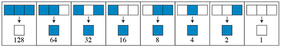
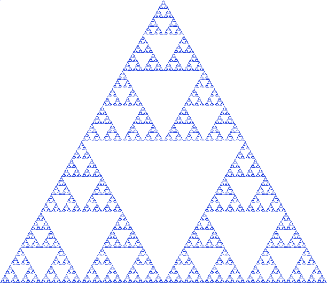
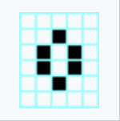
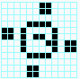
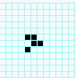

# <ins>  Game of life

[](https://app.codacy.com/gh/AntoineRbd/game_of_life?utm_source=github.com&utm_medium=referral&utm_content=AntoineRbd/game_of_life&utm_campaign=Badge_Grade_Settings) [](https://www.codacy.com/gh/AntoineRbd/game_of_life/dashboard?utm_source=github.com&utm_medium=referral&utm_content=AntoineRbd/game_of_life&utm_campaign=Badge_Coverage)

### Authors:
- Antoine Roubaud

# Table of content
* [Definition](#definition)
* [History](#history)
    - [Application](#application)
        - [Example](#example)
* [Game of life](#game-of-life)
    - [Stable structure](#stable-structure)
    - [Oscillating structure](#oscillating-structure)
    - [The vessels](#the-vessels)
* [One dimensional automaton](#one-dimensional-automaton)
* [How to play](#how-to-play)

---
# Definition
A cellular automaton is a grid of "cells" each containing a "state" (black or white) and which can evolve over time. The state of a cell at time `t + 1` (next "generation") is a function of the state at time `t` of a finite number of cells called its "neighbourhood". At each new generation, the same rules are applied simultaneously to all cells in the grid (and all cells in a single row for one-dimensional automata), producing a new generation of cells that depends entirely on the previous generation.

---
# History
Created and developed in the 1970s, cellular automata can illustrate certain physical phenomena.
The most famous automaton was invented in 1970, a cellular automaton in two parts by Jhon Conway: The Game of Life.

---
## Application:

Today there are more than a hundred different rules on cellular automata. These cellular automata are mostly in one dimension (although there are some in two and three dimensions).

For those in one dimension their rules consist in giving birth, letting live or killing a cell at the next generation according to the neighboring cells.

### <ins>  Example : 
> Rule n° 126 : Sierpinski's triangle




---

# Game of life
The game of life is a two-dimensional cellular automaton that follows a number of rules.

#### <ins> The rules are the following:</ins>
- A cell survives to the next generation if it has two or three neighbors. 
- A cell is born in the next generation if it has exactly three neighbors.
- A cell dies of isolation if it has only one neighbor and dies of overpopulation if it has more than three neighbors.

- #### Stable structure:
A stable structure is a structure that does not move over the generations, no more death or birth.

Like for example the beehive:




- #### Oscillating structure :
Some structures in the game of life have an oscillating character, they are repetitive. They repeat themselves every `n` generations.

As for example the clock :



- #### The vessels:
The gliders are structures able, after a number of `n` generations to produce a copy of themselves, but shifted in the universe.

Let's take as an example the glider, this structure repeats itself every four generations and moves diagonally.




---

# One dimensional automaton
One dimensional cellular automata define the state of the cell at generation `t + 1` according to the neighbors at state `t`. This represents 8 possible configurations which give rise to a living or dead cell. 
that is 2<sup>8</sup> = **256** possible rules.

---

# How to play
To be able to play a help command is available:
```
python3 game_of_life.py -h
```

To start the game of life you just need to run the following command specifying the size of the universe with the `-s` option:
```
python3 game_of_life.py -s 50
```
If no size is given, the default size is 100x100.

To run a one dimensional cellular automaton just type the following command specifying the rule number with the `-r` option:
```
python3 game_of_life.py -s 100 -r 126
```
Here it is the rule 126 (the Sierpinski triangle) which is drawn on a universe of size 100x100.
Again if no size is given it is the default size that is taken.

If the number of the rule given is not between 0 and 256 an error message is sent and the program stops working.
